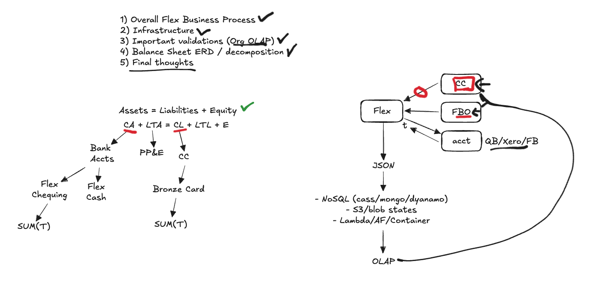

# Question 1: ERD Diagram & Balance Sheet Decomposition

## Summary of the ERD Diagram / Balance Sheet Decomposition
 
### Video & Transcript

Link to google drive: https://drive.google.com/drive/folders/18aaOj0c4sKdz5XpzuTkaB5Hl3OvSjTfJ?usp=sharing

Just a heads up, the video went a bit longer than I wanted. I would suggest watching the video at a higher speed. Sorry!
<iframe width="560" height="315" src="https://drive.google.com/file/d/14uYShQ4TVPnmC9oTcokOWsN8rXNMPk4j/view?usp=drive_link" frameborder="0" allow="accelerometer; autoplay; clipboard-write; encrypted-media; gyroscope; picture-in-picture" allowfullscreen></iframe>

### ERD Diagram

